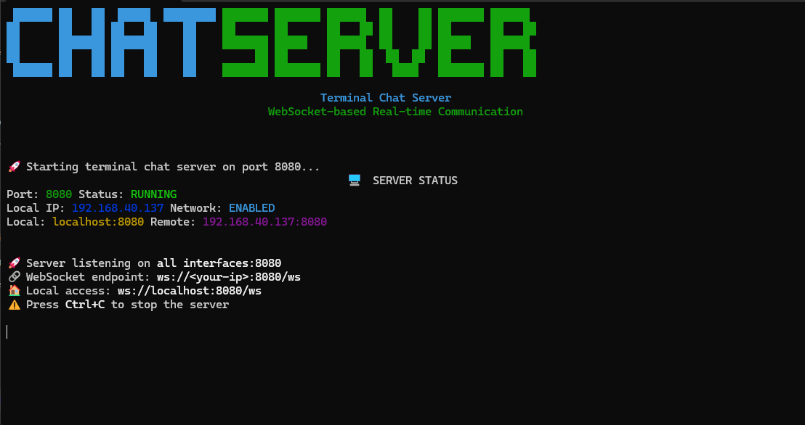
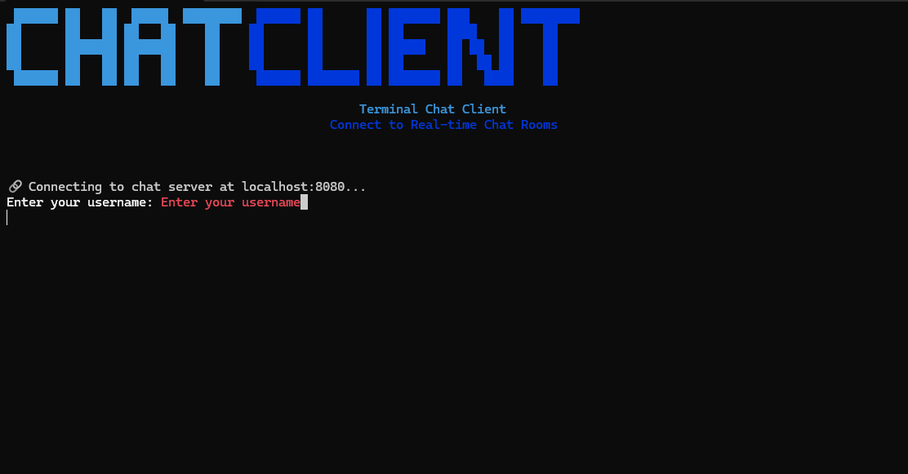
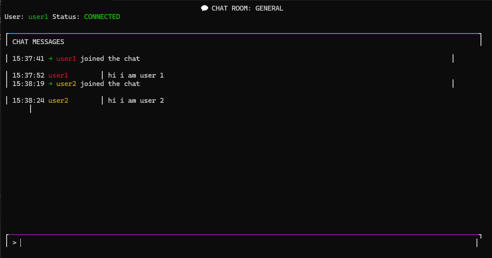
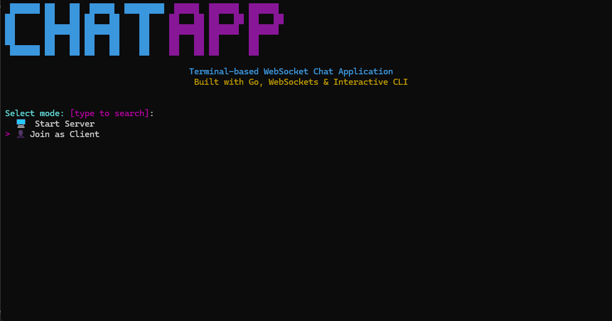

# Terminal Chat Application

This project is a simple terminal-based chat application built in Go. It allows multiple clients to connect to a central server and exchange messages in real-time.

## Features

*   **Client-Server Architecture:** A dedicated server handles message routing between connected clients.
*   **Real-time Messaging:** Messages are broadcast to all connected clients instantly.
*   **User Identification:** Clients can set a username upon connecting.
*   **Simple Command-Line Interface:** Easy to use from any terminal.

## Screenshots





<!-- ## Video Demo -->
<!-- [Link to Video Demo](https://www.youtube.com/watch?v=your-video-id) -->

## Project Structure


The project is organized into the following main components:

*   `server/`: Contains the Go source code for the chat server.
*   `client/`: Contains the Go source code for the chat client.
*   `common/`: (Potentially) Could contain shared data structures or utility functions used by both server and client.

## How to Run

### Prerequisites

*   Go (version 1.16 or higher recommended)

### Building the Application

1.  **Clone the repository:**
    ```bash
    git clone https://github.com/your-username/terminal-chat.git
    cd terminal-chat
    ```

2.  **Build the server:**
    ```bash
    
    go build -o chat-server ./cmd/server  #for linux and macos
    go build -o chat-server.exe ./cmd/server  #for windows
    
    ```

3.  **Build the client:**
    ```bash
    
    go build -o chat-client ./cmd/client  #for linux and macos
    go build -o chat-client.exe ./cmd/client  #for windows
    
    ```

### Running the Application

1.  **Start the server:**
    Open a new terminal and navigate to the `server` directory:
    ```bash
    
    ./chat-server
    ```
    The server will start listening for connections, typically on port `8080` (or as configured).

2.  **Start clients:**
    Open one or more new terminals for each client. Navigate to the `client` directory:
    ```bash
    
    ./chat-client
    ```